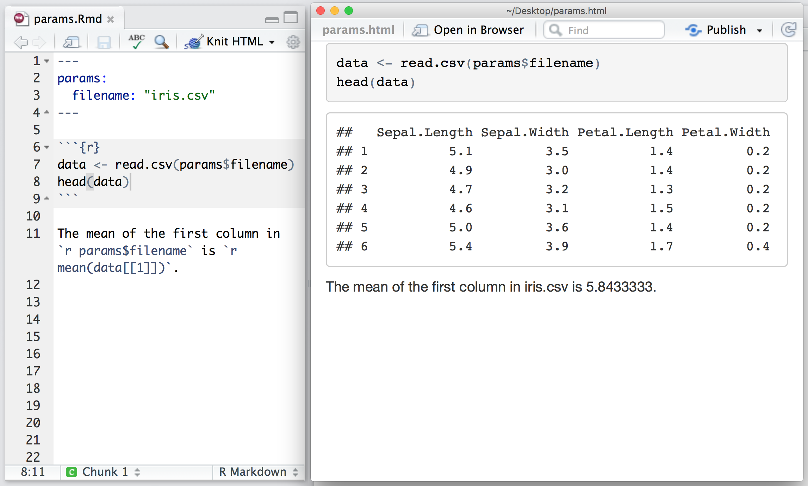

## markdown

markdown is a lightweight markup language with plain text formatting syntax. Its design allows it to be converted to many output formats, but the original tool by the same name only supports HTML.


## Rmarkdown

Extend the markdown concept to run `R` code.


Full tutorial at https://rmarkdown.rstudio.com/authoring_quick_tour.html

## Render

To render the Rmarkdown file to HTML or PDF, you can use the `knit` button or 

```
rmarkdown::render("input.Rmd")
```

## Using parameters

Parameters in the header of the document define format of the output.

```
---
title: "Sample Document"
output:
  html_document:
    toc: true
    theme: united
---
```

or to define variables used in the file at some point. 




To render the Rmarkdown file to HTML or PDF with different parameters using the `rmarkdown` package:

```
rmarkdown::render("input.Rmd", params = list(filenames="otherfile.txt"))
```

## Example

Download this material from github:

https://github.com/pilm-bioinformatics/pilmbc104-best-of-r/archive/master.zip

Extract the content, you should have a folder with this name: `pilmbc104-best-of-r-master`.

Double click on `pilmbc104.Rproj`.

Open `tidyverse.Rmd` and click `knit`.

Then go to the `Console` and type `rmarkdown::render("ggplot2.Rmd")`.

You should see two HTML files now.

